# iOS使用RAC实现MVVM的正经姿势

### 从MVC到MVVM

| 更新时间       | 更新内容 |
| ---------- | ---- |
| 2017-07-19 | 发布   |

#### 前言

[MVVM](https://en.wikipedia.org/wiki/Model%E2%80%93view%E2%80%93viewmodel)是微软于2005年开发出的一种软件架构设计模式，主要是为了在WPF和Silverlight中更简单的对UI实现事件驱动编程。在WPF和Silverlight中，通过MVVM成功的实现了UI布局和数据逻辑的剥离。虽然WPF和Silverlight最后都没有推广开来，但是还是让大家看到了MVVM设计模式的优秀之处。

我有幸在早年参加过[Expression Blend](https://en.wikipedia.org/wiki/Microsoft_Blend)的自动化测试工作，期间做了不少WPF和Silverlight的App，算是较早一批接触熟悉MVVM的天朝码农了。在iOS平台出现了可以优雅实现MVVM的RAC时，着实激动了一下。下面就让我们先从最早的MVC开始慢慢说起。

如果你想简单点直接看代码：[Show you the code](https://github.com/HarrisonXi/MvvmDemo)。

#### MVC理想设计模式

MVC是一种比较古老软件架构设计模式，主旨是将代码分为UI、数据和控制逻辑三大部分：

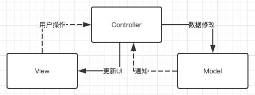

一个UI交互的整体过程：View接受用户操作发送给Controller，Controller根据操作对数据进行修改，Controller接受数据修改的通知，并根据通知更新对应的UI。当然Controller可能有一些自有逻辑会修改数据或者更新UI，从属关系上来说View和Model都属于Controller。

#### MVC实例

这是我比较喜欢的一个实例，实现一个简单的登录界面。先罗列一下简单的需求：

1. 用户名有效长度为4-16位，无效时对应文本框显示为红色底色，有效时文本框显示为绿色底色，无输入时显示为白色底色。
2. 密码有效长度为8-16位，对应文本框底色逻辑与用户名文本框一致。
3. 登陆按钮在用户名和密码均有效时可用，否则禁用。

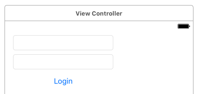

为了让代码看起来不那么多，我使用xib来绘制了简单的UI并完成了IBOutlet和delegate等的绑定。

然后呢需要写的代码就是大概下面这样了：

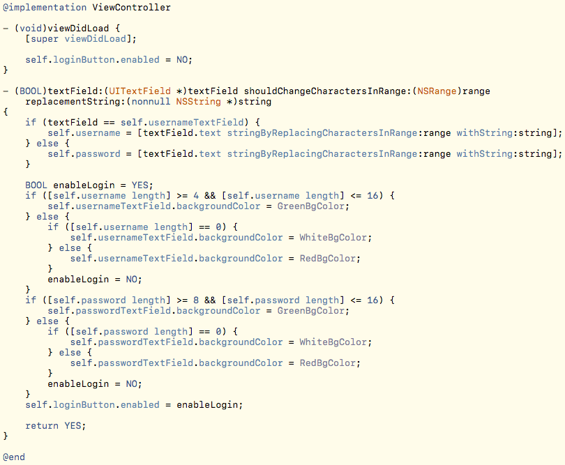

这里的`username`和`password`两个属性可以看作Model层，文本框和按钮的xib就是View层，VC主体代码就是Controller层。可以看到所有的Model修改逻辑和UI更新逻辑都是在Controller里一起完成的。（[完整代码](https://github.com/HarrisonXi/MvvmDemo/releases/tag/MVC)）

#### MVC解决的问题和优缺点

- 代码成功分化为UI、数据和控制逻辑三大部分。
- 易于理解使用，普及成本低。
- Controller拥有View和Model，几乎可以控制所有逻辑。
- 细节不够明确，基本上不明确归属的代码全部会放在Controller层。
- 和UI操作事件绑定较重，难以进行单元测试。

#### MVC实际使用状况

因为上一节中提到的3和4两点，很多代码都只能写在Controller层。还因为xib的特殊性，对多人协作十分不友好，导致大部分UI的布局和初始化代码要用代码实现，而这些代码写成单独的类也多有不便，导致本该出现在View层的代码也堆积在了Controller层。而且在iOS中，UIViewController和UIView本来就是一一对应的。这就导致了MVC从最早的**Model-View-Controller**最终一点点变成了**Massive-View-Controller**：

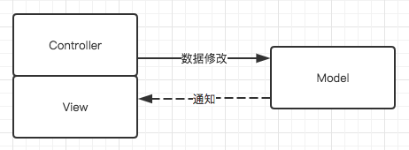

#### MVP设计模式

所谓设计模式，就是软件设计过程中为了解决普遍性问题而提出的通用解决方案。MVP的出现就是为了解决MVC的Controller越来越臃肿的问题，进一步明确代码的分工：

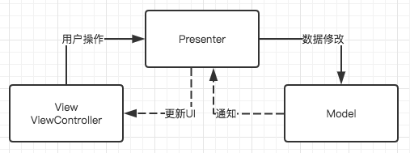

这个图看上去和MVC很相似，但是这里的实虚线和MVC设计模式不同。所表示的意义为View层持有Presenter层，Presenter层持有Model层，View层并不可直接访问到Model层。整体的UI交互流程和MVC类似。

这么做的意义就在于真正意义上的将UI逻辑和数据逻辑隔离，而隔离之后就可以更方便的对数据逻辑部分进行单元测试，隔离的另一个好处就是解开了一部分的耦合。

#### MVP实例

接着刚刚的实例，我们在它的基础上继续进行修改。

首先我们需要定义一个Presenter，头文件内把所有可接受的用户操作和更新UI需要用的回调定义好：

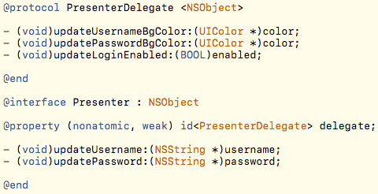

Presenter的内部实现：

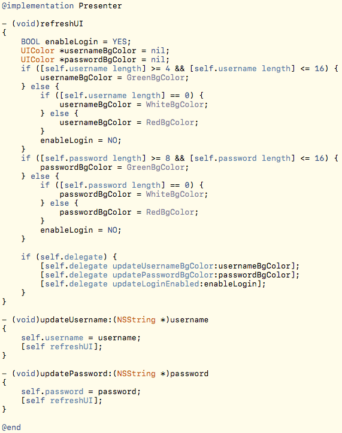

可以看到Presenter做的事情就是把原来Controller的逻辑控制相关代码抽离出来构建成一个单独的类。接下来看一看对应的Controller现在变成什么样：

现在Controller的代码变得更加清晰了：两个更新数据的调用，三个更新UI的调用，多了一些初始化Presenter的操作。

因为现在Presenter只包含逻辑，所以我们也较容易实现一个单元测试：

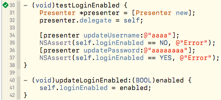

从结果可以看到Controller的代码转移了一部分到Presenter，MVP也成功把逻辑和UI代码分离了。（[完整代码](https://github.com/HarrisonXi/MvvmDemo/releases/tag/MVP)）

#### MVP优缺点

- UI布局和数据逻辑代码划分界限更明确。
- 理解难度尚可，较容易推广。
- 解决了Controller的臃肿问题。
- Presenter-Model层可以进行单元测试。
- 需要额外写大量接口定义和逻辑代码（或者自己实现KVO监视）。

#### MVVM设计模式

随着UI交互越来越复杂，MVP本身的一些缺点还是会暴露出来。

比如虽然是可以写单元测试，但是单元测试写起来还是有很多“啰嗦”的部分，需要模拟一些假的UI处理逻辑来进行结果的验证，即使用block写法这个部分的代码量也省不了太多。

所有的用户操作和更新UI的回调需要细细定义，随着交互越来越复杂，这些定义都要有很大一坨代码。

逻辑过于复杂的情况下，Present本身也会变得臃肿难以重用，代码也会变的更加难以阅读和维护。

这时候，MVVM出现了，为了解决以上大部分问题：

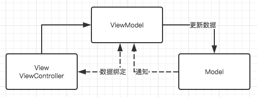

首先ViewModel-Model层和之前的Present-Model层一样，没有什么大的变化。View持有ViewModel，这个和MVP也一样。变化主要在两个方面：

1. ViewModel相较于Present，不仅仅是个逻辑处理机，它附带了自己的状态，所以被才可以被称为“Model”。ViewModel也因为这个变的更加独立完整，**我们更容易通过ViewModel的状态去进行单元测试**。Presenter在没有设置回调的时候其实一直在做空运算而已，运算得到的值没有进行存储，下次必须重新运算。
2. View不直接通过传递用户操作来控制ViewModel，ViewModel也不直接通过回调来修改View。对常用的数据和UI控件的事件&属性，MVVM框架的底层均进行了封装，使得我们可以进行数据绑定操作。简单来说我们可以用类似`[viewModel.username bind:usernameTextField.text]`类似的操作使得viewModel的属性和UI控件的属性相互绑定，其中一方修改的时候另一方直接自动做对应更改。**这样的话我们就不用重复的书写很多回调操作，也不用处理一大堆UI控件的delegate事件**。

其实MVVM的精华小部分在ViewModel，更大部分就在数据绑定，甚至有很多人觉得应该称MVVM为MVB（Model-View-Binder）。

数据绑定引申出来的一个概念就是数据管道（转换器），这个和大家学的数字电路比较相似：

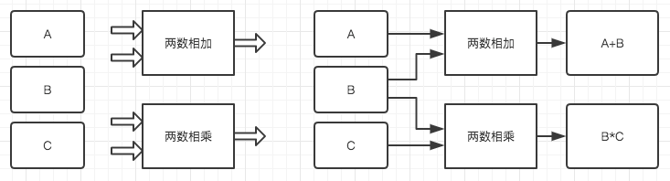

这里我们有ABC三个数据源和两个双输入的转换器，我们可以进行组合得出各种想要的结果（如上图），甚至于我们可以多次组合来完成更复杂的计算（如下图）：

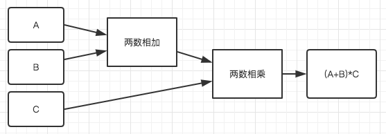

这里的转换器就带来了第三点改进：

3. 基于数据绑定和数据管道，**可以对运算逻辑进行拆分和重用，最大程度的使代码易读易维护**。

#### MVVM实例

还是接着刚刚的工程，首先要参照[Reactive Cocoa](https://github.com/ReactiveCocoa/ReactiveObjC)的文档把RAC添加到工程里。

##### ViewModel的定义

然后我们首先要把Present改造成ViewModel：

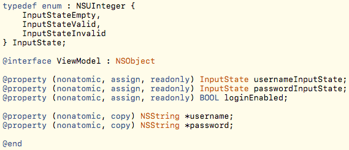

这里可以看到作为ViewModel输出值的属性设置成了readonly，剩下的`username`和`password`是输入值。

##### 单元测试

值得一提的是软件工程中最好是测试驱动开发（TDD）而不是写完逻辑再补测试，所以我们先改好单元测试：

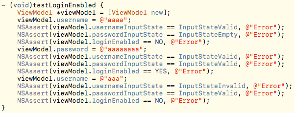

从单元测试也很容易看出来ViewModel现在足够独立并易于测试。

##### View层和ViewModel层的绑定

我们再看一眼现在Controller应该怎么写：

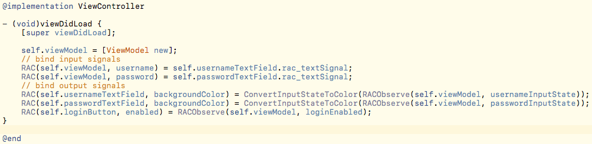

首先看到原来的一行`loginButton`初始化代码没有了，因为数据绑定是自动更新的，初次绑定就会初始化状态。

对ViewModel进行输入数据的绑定，不再需要写UITextFieldDelegate然后再传递事件，一行代码完成绑定。

同样将ViewModel的输出数据绑定到UI，不需要再实现对应的回调，一样一行代码完成绑定。

这就是MVVM设计模式在最理想的情况下，Controller里需要和ViewModel交互的所有代码内容。

##### 数据管道（转换器）

现在来说说刚刚的`ConvertInputStateToColor`，它其实就是一个状态到颜色的转换器：

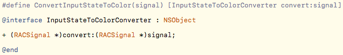

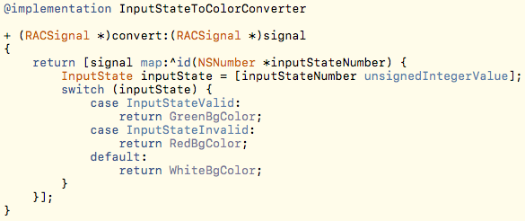

这里利用RACSignal的map方法做了一个映射，这就是我们的转换器。当然我们以后也可以实现别的转换器来进行方便的替换，比如实现一个仅在有效态显示绿色其他状态都显示白色的转换器。另外这个转换器如果写的更通用点，也可以被别的模块重复使用。

##### ViewModel的UI无关性／转换器组合的多样可能性

这里要提一下为什么ViewModel不直接提供颜色值的输出：

1. ViewModel应该不关心具体的UI相关逻辑，只关心自己的逻辑正确和独立完整性。
2. 易于进行单元测试，枚举当然比颜色值好检查点……
3. 提供更为基础的状态，这样和不同的转换器组合会产生更多的可能性。

这里的可能性指什么呢？举个例子：出现了用户有输入内容时展示对应文本框清空按钮的新需求。这时候我们只需要完成一个新的转换器：`InputStateEmpty`时返回`isHidden = YES`；其余情况下返回`isHidden = NO`。然后把对应输出源通过转换器绑定到清空按钮的`isHidden`属性上即可。另外上一节提到的另一种颜色转换器，也是一种多样性的体现。

4. 可以进行二次组合，用以计算输出值`loginEnabled`。（见下一节）

##### ViewModel的完整实现

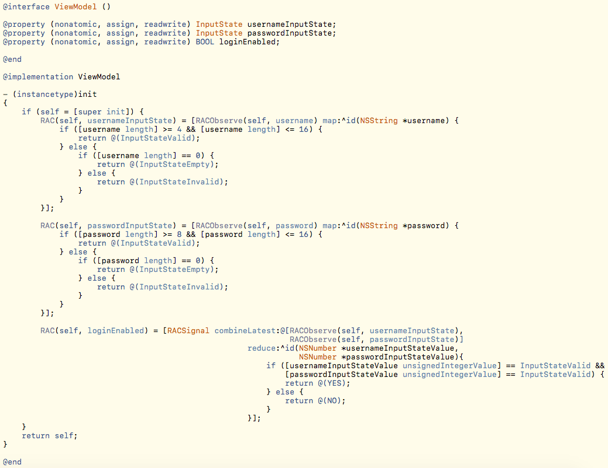

需要把输出源对应的属性偷偷改成readwrite的先，不然不可写的话绑定的时候会跪。😂

可以看到ViewModel现在就三块逻辑：

1. 内部实现了一个转换器，监视`username`值更新对应的`usernameInputState`值。
2. 内部又实现了一个转换器，监视`password`值更新对应的`passwordInputState`值。
3. 监视`usernameInputState`和`passwordInputState`两个输出值，经过转换再输出`loginEnabled`值。

这三块逻辑都十分独立且逻辑清晰，这就是MVVM或者说RAC带来的优势。

回想一下最早时候MVC里的Controller，在UITextField的回调里UI操作和数据逻辑混杂在一起，计算`loginEnabled`属性的逻辑还夹杂在计算文本框颜色的逻辑中。

##### 相似的代码可以再次合并

刚刚的代码里，其实计算`usernameInputState`和`passwordInputState`两个值的转换器十分类似。如果以后还可能有类似的转换需求，我们应该把它俩的转换器再合并成独立的转换器，方便重用：

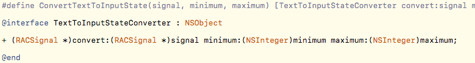

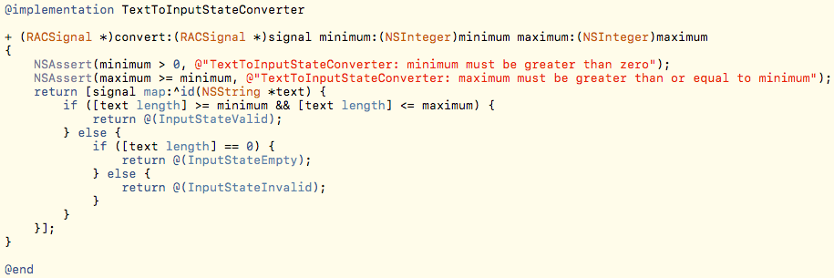

记得做好断言防止写错调用代码，不过看上去转换器逻辑不需要额外做错误保护。

有了新的转换器，如果以后出现了验证码限制长度为5之类的需求，它就有用武之地了。

在此基础下ViewModel的代码也再次简化为：

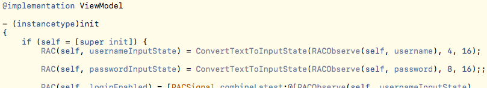

可以看到代码更清晰易懂了😎，虽然貌似代码量没有减少多少🙄️。

另外这里也看出来很灵活的一点，转换器可以直接写ViewModel里，也可以抽离成单独的类，这需要根据具体情况来定不同的写法。

##### 为转换器写单元测试

简单点的办法是把逻辑从RACSignal的map方法里抽出来，这样就可以单独测试逻辑了：

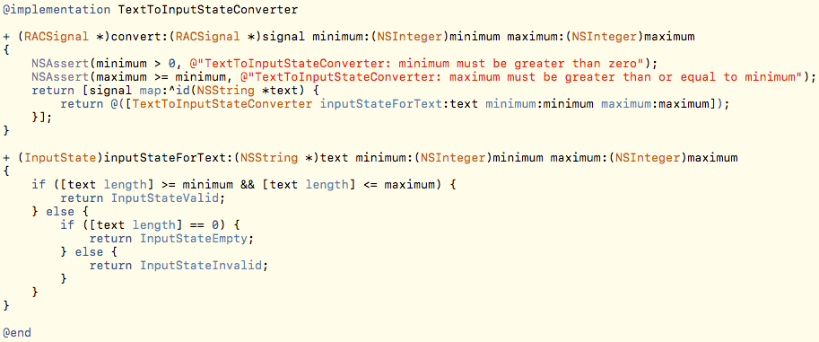

添加完单元测试的完整MVVM设计模式实例代码在这里：[完整代码](https://github.com/HarrisonXi/MvvmDemo/releases/tag/MVVM)。

当然，如果不想破坏转换器类的实现方式，有另一种单元测试的方案（这个我会另写一篇博客来介绍）：

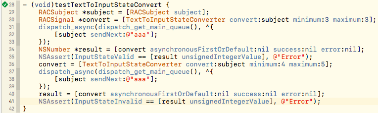

#### MVVM优缺点

1. UI布局和数据逻辑代码划分界限更明确，数据逻辑还可以细分成各种转换器。
2. 很难理解正确使用姿势，使用难度高容易出错，且出错调试难度也很大。
3. 代码量相较MVP应该有所减少，逻辑更清晰使得代码易读性重用性有所提高（用对姿势的话）。
4. 更方便实现单元测试。
5. 内存和CPU开销较大。

#### 总结

设计模式不是银弹，任何设计模式均有适用的场景，并没有某种设计模式可以解决所有的问题。

比如UI交互较少较轻的页面，用MVC直接实现就会很轻松。

比如团队整体水平较低，强行使用MVVM也会面临困境。

学习和了解新的设计模式主要是开拓自己的眼界，以后面临问题的时候可以多一个新的选择。

而且谁说MVC就不能用RAC做数据绑定呢？MVC的Controller太臃肿了，也可以用Category来分散代码不是么？

------

© 2017 苹果梨　　[首页](/)　　[关于](/about.html)　　[GitHub](https://github.com/HarrisonXi)　　[Email](mailto:gpra8764@gmail.com)
