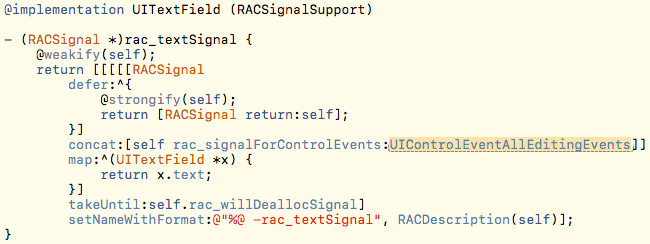
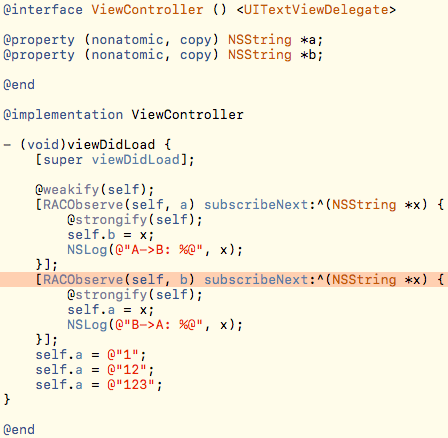
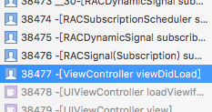
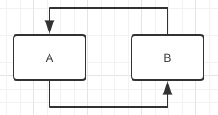
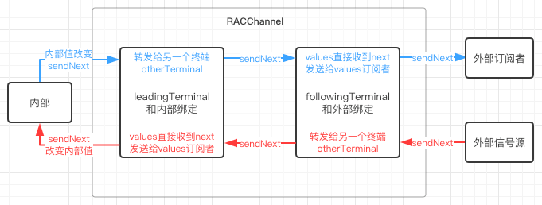
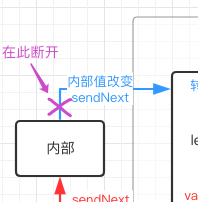

# RAC中用RACChannel实现双向绑定

| 更新时间       | 更新内容                            |
| ---------- | ------------------------------- |
| 2017-07-27 | 发布                              |
| 2017-09-07 | 调整下RACKVOChannel章节内子章节的顺序，做了些补充 |

### 尝试直接用RACSignal实现双向绑定

在某些场景下，我们需要把两个数据相互绑定，A的改动影响B，B的改动也影响A。

为了表现上容易观察，我们先假设有一个同步两个文本框输入内容的需求。

```
RAC(self.textFieldA, text) = self.textFieldB.rac_textSignal;
RAC(self.textFieldB, text) = self.textFieldA.rac_textSignal;
```

实现两个文本框，用上面的代码相互绑定，然后观看效果：


可以看到所得到的效果和我们想要的是一致的。但是这只是一个比较凑巧的案例，因为UITextField的`rac_textSignal`监视的其实是UI事件：



在UITextField的`text`属性改变时，不会触发`rac_textSignal`。所以在A->B的信号影响了B的`text`时，不会触发B->A的信号。

### 对通常的数据用RACSignal实现双向绑定会出现的问题

而对于通常的数据来说进行双向绑定就会出错，代码和错误直接一图流甩出来先：



看一眼错误的根源：



可以看到这里出错的原因就是调用堆栈溢出了。因为双向绑定完成后，A的改动影响了B，然后B的改动又会影响A，形成了一个信号循环：



打破这个循环的方法也很简单，在信号订阅的block体内进行数据改动时，想办法不发出信号：

```
@weakify(self);
[RACObserve(self, a) subscribeNext:^(NSString *x) {
    @strongify(self);
    self->_b = x;
    NSLog(@"A->B: %@", x);
}];
[RACObserve(self, b) subscribeNext:^(NSString *x) {
    @strongify(self);
    self->_a = x;
    NSLog(@"B->A: %@", x);
}];
```

在这里我们使用成员变量去修改A和B就可以了，完美搞定。

但是这不是万能的，存在很多缺陷：

1. 没办法使用`RAC(self, a) = RACObserve(self, b);`这样优雅的写法了。
2. 访问不到内部成员变量的时候，没有办法这样写。
3. 如果为了这个需求来暴露内部成员变量，也是很不明智的行为，会破坏ViewModel的稳定性和封装性。

### RACChannel的出现

在这个时候，RACChannel就随需要出现了。

##### RACChannelTerminal简介

当然看RACChannel要先看RACChannelTerminal，RACChannelTerminal它是一个RACSignal同时也是一个RACSubscriber，就是说它能发出信号也能订阅信号。我们之后称呼它为终端，它在初始化的时候传入了两个值：

1. `values`：终端自己对应的RACReplaySubject（作为RACSignal使用）。外部订阅终端时订阅的实际上是`values`。
2. `otherTerminal`：另一个终端对应的RACReplaySubject（作为RACSubscriber使用），终端在订阅外部信号后会把收到的信号都转发给`otherTerminal`。

##### RACReplaySubject简介

RACReplaySubject是一种特殊的RACSubject，它可以向新的订阅者重新发送一遍之前所发过的信号。初始化RACReplaySubject的时候会要求设置一个`capacity`，默认值为NSUIntegerMax，RACReplaySubject会replay最多`capacity`个发过的`next`信号。值得注意的是，`completed`和`error`信号是始终会replay的，和`capacity`设置的大小无关。

##### RACChannel代码解析

我们回过头来看RACChannel的完整代码：

```
@implementation RACChannel

- (instancetype)init {
    self = [super init];

    // We don't want any starting value from the leadingSubject, but we do want
    // error and completion to be replayed.
    RACReplaySubject *leadingSubject = [[RACReplaySubject replaySubjectWithCapacity:0] setNameWithFormat:@"leadingSubject"];
    RACReplaySubject *followingSubject = [[RACReplaySubject replaySubjectWithCapacity:1] setNameWithFormat:@"followingSubject"];

    // Propagate errors and completion to everything.
    [[leadingSubject ignoreValues] subscribe:followingSubject];
    [[followingSubject ignoreValues] subscribe:leadingSubject];

    _leadingTerminal = [[[RACChannelTerminal alloc] initWithValues:leadingSubject otherTerminal:followingSubject] setNameWithFormat:@"leadingTerminal"];
    _followingTerminal = [[[RACChannelTerminal alloc] initWithValues:followingSubject otherTerminal:leadingSubject] setNameWithFormat:@"followingTerminal"];

    return self;
}

@end
```

首先RACChannel创建了两个RACReplaySubject，这是内部的数据通信管道主要组件。

其中`followingSubject`的`capacity`为1，表示会replay最后一次的信号。因为`followingSubject`是供外部订阅用的，所以首次被订阅时需要给外部一个初始值。

然后这两个RACReplaySubject相互监视了对方的`completed`和`error`信号（`ignoreValues`用于排除`next`信号），这是为了保证两个Subject始终同步，不会其中一个已经终止了另一个还在工作。

最后创建了两个终端将这两个Subject相互绑定，终端所做的工作图示如下：



总体看下来，RACChannel的设计思想上就是提供两个终端，每个终端各有一个输入口和一个输出口，一个终端负责和内部数据绑定，一个终端暴露出来供外部数据绑定。上图把外部订阅者和外部信号源分开来写，表示它们可能是不同的对象，当然它们也可以是相同的对象（如另一个RACChannel的终端）。一般来说封装好的供使用的RACChannel会将其中一个终端在内部处理好，暴露另一端供使用者进行输入和输出的绑定。

##### RACChannel尚难直接使用

这么看下来，是不是创建个RACChannel，把四个口绑定好就可以双向传输数据了？试一试：

```
RACChannel *channel = [RACChannel new];
RAC(self, a) = channel.leadingTerminal;
[RACObserve(self, a) subscribe:channel.leadingTerminal];
RAC(self, b) = channel.followingTerminal;
[RACObserve(self, b) subscribe:channel.followingTerminal];
```

然后，你会再次得到调用堆栈溢出的错误。😂

因为RACChannel只是实现了双向绑定的设计思想，并没有帮我们处理循环调用的问题。我们在使用RACChannel的时候一般是需要使用它的子类，或者自己设计好代码在某条信号通路上进行打断。

### RACKVOChannel

看了那么多代码和原理，是时候晒一下简便正确的写法振奋人心了。想要实现A和B双向绑定，其实一句就可以：

```
RACChannelTo(self, a) = RACChannelTo(self, b);
```

这就是前文提到的在内部实现好循环调用终止条件的RACChannel了。

##### RACChannelTo的展开

我们把`RACChannelTo(self, a)`先展开来，看一下它到底做了什么：

```
[[RACKVOChannel alloc] initWithTarget:self keyPath:@"a" nilValue:nil][@"followingTerminal"]
```

所以说，上面实现双向绑定的语句展开来，实际上做了两件事：

1. 为A和B分别创建了`channelA`和`channelB`。
2. 调用`channelA[@"followingTerminal"] = channelB[@"followingTerminal"]`。

如果你对宏定义展开的细节感兴趣，我觉得Sunny大大的[这篇博客](http://blog.sunnyxx.com/2014/03/06/rac_1_macros/)可以帮到你。

##### RACKVOChannel如何实现双向绑定

我们看一下这段代码：

```
@implementation RACKVOChannel (RACChannelTo)

- (RACChannelTerminal *)objectForKeyedSubscript:(NSString *)key {
    NSCParameterAssert(key != nil);

    RACChannelTerminal *terminal = [self valueForKey:key];
    NSCAssert([terminal isKindOfClass:RACChannelTerminal.class], @"Key \"%@\" does not identify a channel terminal", key);

    return terminal;
}

- (void)setObject:(RACChannelTerminal *)otherTerminal forKeyedSubscript:(NSString *)key {
    NSCParameterAssert(otherTerminal != nil);

    RACChannelTerminal *selfTerminal = [self objectForKeyedSubscript:key];
    [otherTerminal subscribe:selfTerminal];
    [[selfTerminal skip:1] subscribe:otherTerminal];
}

@end
```

`objectForKeyedSubscript:`提供了通过键`@“followingTerminal”`读取终端的能力，`setObject:forKeyedSubscript:`提供了通过键`@“followingTerminal”`设定和绑定终端的能力。

绑定的操作其实就是将两个`followingTerminal`相互订阅。注意因为两端数据是同步的，所以在正向订阅后两端的值应该一样了，所以在反向绑定的时候就可以`skip:1`来节约点性能了。

##### RACKVOChannel在哪里打断了信号通道的循环调用

可以看到这段代码首先创建了一个RACKVOChannel，RACKVOChannel里主要做的两件事就是`leadingTerminal`的`sendNext`和`leadingTerminal`和`subscribeNext`，这个从前面一点点读下来的读者应该都能明白，是将目标的指定属性和RACKVOChannel的`leadingTerminal`做好绑定。

我们主要关注的是，RACKVOChannel在哪里打断了信号通道的循环调用。先看`subscribeNext`段里这一部分：

```
// Set the ignoreNextUpdate flag before setting the value so this channel
// ignores the value in the subsequent -didChangeValueForKey: callback.
[self createCurrentThreadData];
self.currentThreadData.ignoreNextUpdate = YES;
```

注释写得比较清楚，这个`ignoreNextUpdate`使得下一次的值修改被忽略。具体的忽略代码在`sendNext`段：

```
// If the change wasn't triggered by deallocation, only affects the last
// path component, and ignoreNextUpdate is set, then it was triggered by
// this channel and should not be forwarded.
if (!causedByDealloc && affectedOnlyLastComponent && self.currentThreadData.ignoreNextUpdate) {
    [self destroyCurrentThreadData];
    return;
}
```

在`ignoreNextUpdate`为YES的时候，这里就会return出去，不会触发`sendNext`操作。

用图片标记的直观点，就是如果是在`leadingTerminal`的`subscribeNext`里修改了目标的属性值，通路会在此打断，不会重复的再把属性址改变的信号`sendNext`出去：



##### RACChannelTo总结

总之进行通常数据的双向绑定，RACChannelTo基本就是无敌的，几乎可以完成绝大部分需求了。

### 其他常见的RACChannel相关的类扩展

RAC库对常用的组件都进行了扩展方便我们使用，下面举几个例子。

##### NSUserDefaults (RACSupport)

```
- (RACChannelTerminal *)rac_channelTerminalForKey:(NSString *)key;
```

为指定的`key`创建一个双向绑定用的RACChannel，在内部和RACKVOChannel做了同样的切断循环操作。注意这里返回的是`followingTerminal`。

##### UITextField (RACSignalSupport)

```
- (RACChannelTerminal<NSString *> *)rac_newTextChannel;
```

为文本的变更创建一个双向绑定用的RACChannel，因为本文最前面提到的原因，文本变更信号是从UI事件触发的，接受新的文本是设置到`text`属性的，所以两者相互独立本来就不会循环调用。另外注意这里返回的是`leadingTerminal`，使用上要特别注意的是初次绑定的时候不会触发一次初始化信号，这样正好可以方便配合别的`followingTerminal`使用而不需要进行`skip:1`。

其它的UI控件的RACChannel扩展和UITextField都类似。

##### 合并使用的示例

这里是一个和ViewModel进行绑定的例子：

```
// 如果仅需要单向绑定，使用rac_textSignal
// RAC(self.viewModel, username) = self.usernameTextField.rac_textSignal;
// 如果需要双向绑定，则使用rac_newTextChannel
RACChannelTo(self.viewModel, username) = self.usernameTextField.rac_newTextChannel;
```

需要注意的一点是，每一次调用`rac_newTextChannel`都是创建一个新的RACChannel，如果需要进行多次重复使用，请自行把获得的RACChannelTerminal保存下来。

如果是NSUserDefaults和UITextField双向绑定，可以手动写一下订阅：

```
RACChannelTerminal *userDefaultsTerminal = [[NSUserDefaults standardUserDefaults] rac_channelTerminalForKey:@"username"];
RACChannelTerminal *textfieldTerminal = self.usernameTextField.rac_newTextChannel;
[textfieldTerminal subscribe:userDefaultsTerminal];
[userDefaultsTerminal subscribe:textfieldTerminal];
```

### 总结

不得不说RAC的作者大神们伟大之极，当之无愧的ObjC新纪元开创者。RACChannel思路简单但是实现起来真的不简单，阅读代码慢慢理解RAC的精华实在是一种愉悦～

------

© 2017 苹果梨　　[首页](/)　　[关于](/about.html)　　[GitHub](https://github.com/HarrisonXi)　　[Email](mailto:gpra8764@gmail.com)
